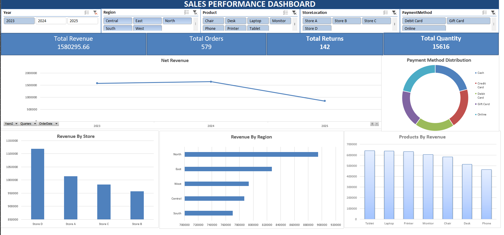

# 📊 Excel Sales Performance Dashboard

## 📌 Project Overview

This project presents an interactive Excel dashboard designed to analyze sales performance across multiple business dimensions including region, product category, store location, and payment method.

The dashboard provides dynamic filtering and KPI tracking to support data-driven decision-making.

---

## 🎯 Key KPIs

- 💰 Total Revenue
- 📦 Total Orders
- 🔁 Total Returns
- 📊 Total Quantity Sold

---

## 📊 Dashboard Features

### 🔹 Interactive Filters
- Year
- Region
- Product Category
- Store Location
- Payment Method

### 🔹 Visualizations Included
- Net Revenue Trend (Line Chart)
- Revenue by Store (Bar Chart)
- Revenue by Region (Horizontal Bar Chart)
- Product-wise Revenue (Column Chart)
- Payment Method Distribution (Donut Chart)

---

## 🛠 Tools Used

- Microsoft Excel
- Pivot Tables
- Pivot Charts
- Slicers
- KPI Cards
- Data Aggregation & Filtering

---

## 📸 Dashboard Preview

  

---

## 🚀 Business Insights

- Identified top-performing regions and stores
- Analyzed product revenue contribution
- Evaluated return impact on revenue
- Assessed customer payment preferences
- Monitored yearly performance trends

---

## 💼 Skills Demonstrated

- Excel Dashboard Design
- Data Visualization
- KPI Tracking
- Business Analysis
- Interactive Reporting
